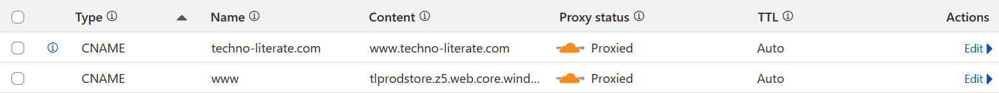

+++
title = "Cloudflare Update and Various Fixes"
date = "2024-12-13"
author = "Ryan Porter"
authorTwitter = "" #do not include @
cover = ""
tags = ["Cloudflare", "DNS", "Azure", "Terraform", "Cypress", "CI/CD"]
keywords = ["", ""]
description = "After unwisely heeding the prompts to migrate from Azure CDN to Azure Front Door, I exposed myself to massive costs. The fix (and a coincidental anniversary) caused a cascade of other bugs in my deployment pipeline."
showFullContent = false
readingTime = true
hideComments = false
color = "" #color from the theme settings
draft = false
+++
After unwisely heeding the prompts to migrate from Azure CDN to Azure Front Door, I exposed myself to massive costs. The fix (and a coincidental anniversary) caused a cascade of other bugs in my deployment pipeline. Here's what happened and how I fixed it.

Previously, [I switched from Wordpress.com to Cloudflare](https://www.techno-literate.com/posts/switching-to-cloudflare-dns/) as my domain registrar and DNS provider. Not long after, I read one of the pop-up messages in the Azure Portal encouraging me to migrate from Azure CDN, which is sunsetting in 2027, to Azure Front Door, which is the latest and greatest content delivery service in Azure. Foolishly, I went ahead with the migration without researching the associated costs. Fellow Cloud Resume Challengers should take heed: Front Door has a monthly base cost of $30, or $360 per year! As soon as I realized that, I deleted Front Door and instead shifted entirely to Cloudflare, which offers content delivery by default with its free tier.

**Issues to be aware of** 
When you stop using an Azure CDN solution (either Azure CDN or Azure Front Door), Azure's TLS certificates will no longer be associated with your domain, but will instead only cover the default domain for your storage account (*.web.core.windows.net). Visitors to your website will get an error and won't be able to view your site at all. This is solved by enabling proxying on Cloudflare for your domain:

If you choose to change your custom domain name in your Storage Account settings, you may have trouble verifying it while the proxying is enabled. You can turn off proxying long enough for the validation to complete, then turn it back on in the Cloudflare dashboard (same place as the above image, in the DNS Records section).

Did I mention an unfortunate anniversary? Right as I began to address the Front Door issue and update my Terraform code, my access keys in Azure expired. It was a bit of a nightmare to identify which ones I specifically needed to refresh, so I suggest that if you encounter a similar issue, that you label the secret keys in an obvious way.

Everything is working now, and I can't express how good it feels to tackle this challenge and finally get a positive result!